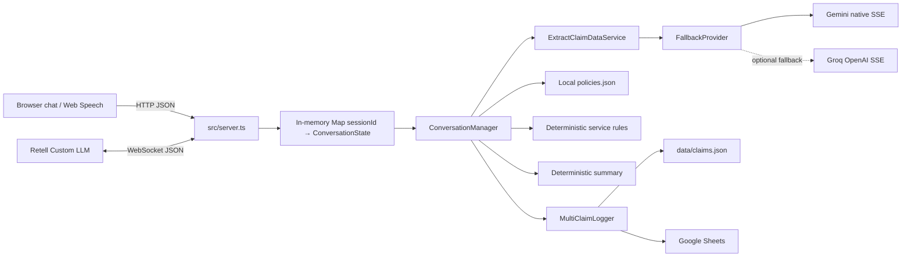

# Architecture

## System at a glance

## Runtime composition

`createRuntimeConversationManager()` in `src/runtime.ts` constructs one manager shared by all sessions. Each `start()` creates fresh state. The manager receives a `FallbackProvider`: native Gemini is always instantiated; Groq joins only when `GROQ_API_KEY` is present. Completion uses `MultiClaimLogger`, which concurrently invokes `LocalJsonClaimLogger` and `GoogleSheetsClaimLogger`.

## Module responsibilities

| Module | Responsibility | External effect |
|---|---|---|
| `server.ts` | HTTP input validation/static UI/session map; Retell events/stream bridge | port listener, WS messages, log endpoint |
| `ConversationManager.ts` | Single-turn orchestration and state mutation | calls services |
| `extractClaimData.ts` | prompt assembly, LLM JSON parsing, response cache | LLM call |
| `llm/gemini.ts` | native `streamGenerateContent` SSE, timeout/retry | Gemini HTTPS |
| `llm/groq.ts` | OpenAI-compatible SSE fallback | Groq HTTPS |
| `verifyPolicy.ts` | local policy file load and fuzzy match | file read at startup |
| `recommendServices.ts` | rules for towing/roadside/callback/garage | none |
| `generateSummary.ts` | deterministic internal summary | none (LLM rewrite disabled) |
| `claimLogger.ts` / `googleSheets.ts` | local file + Sheet persistence | filesystem/Google API |

## Boundary decisions actually implemented

- Retell sends already-transcribed turns; server sends text fragments, not audio.
- Browser uses HTTP; browser Web Speech performs STT/TTS locally.
- State is explicit and in memory. Only completed claims are persisted.
- The LLM returns both spoken language and a slot patch in one JSON generation; it is not a separate extraction-and-generation pipeline.
- No provider SDKs are installed: integrations use `fetch` and `googleapis`.

## Dependencies

Direct runtime dependencies: Express 5 (HTTP/static), ws (Retell socket), dotenv (startup env), googleapis (Sheets). Dev dependencies are TypeScript, tsx, and type packages. There is no database, queue, Redis, tracing, auth, validation library, Retell SDK, or official Gemini SDK.

## Trust boundaries

1. Browser/Retell transcript enters the service.
2. Transcript, current claim state, and four-message history are supplied to third-party LLM infrastructure.
3. Provider output is parsed as JSON and used to update claim state after light validation.
4. Finished PII is written to local disk and a Google spreadsheet.

This is an architectural prototype, not a compliance boundary: no authentication, authorization, encryption/retention policy, secret manager, tenancy isolation, or audit-grade immutability is implemented.
