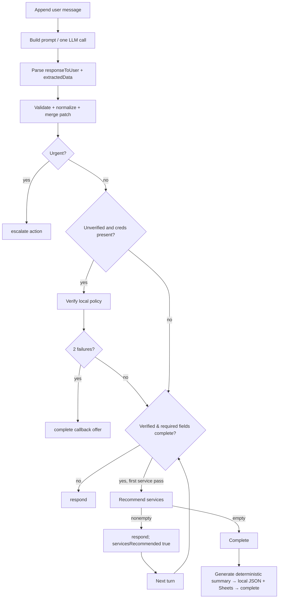

# Execution Flow

## Browser path

1. `public/app.js` calls `POST /chat/start` and receives session ID plus the greeting.
2. Each typed/STT message goes to `POST /chat` as `{sessionId,userMessage}`.
3. Server validates nonempty string (32 KB JSON body), loads/creates the session, then awaits `ConversationManager.handleUserMessage`.
4. Server stores returned state and responds with action, assistant text, and limited state. On `complete`, it adds a simulated email payload.

## Retell path

1. A `ws` connection creates a fresh session, sends `config`, and immediately sends greeting response ID 0.
2. `call_details` is acknowledged by avoiding a second greeting; `ping_pong` is echoed; `ping` receives an empty final response; `update_only` is ignored.
3. For `response_required` or `reminder_required`, the latest `transcript` entry with `role === 'user'` is selected. The full transcript is otherwise not persisted into state by this adapter.
4. Per-session `activeResponseIds` rejects equal/older response IDs. The manager is invoked asynchronously inside `AsyncLocalStorage` request context.
5. Model chunks are searched for the JSON `responseToUser` string and forwarded as `content_complete:false` fragments. When orchestration finishes, remaining content (or whole fallback message) is sent with `content_complete:true`. `end_call` is true only for a final acknowledgement after a verified claim is fully complete, has a reference number, has no missing fields, and has been persisted. Callback offers, escalations, and repeated Retell transcripts never terminate the call.

## Single manager turn

## Completion path

`completeClaim()` generates `CLM-YYYYMMDD-NNNN`, builds a deterministic summary, sets `completed`, then awaits durable logging before it replies that the claim has been logged. A later caller acknowledgement is the only normal path that produces Retell `end_call`. Google Sheets catches its own errors; local JSON errors reject the entire turn.

## Execution-path notes

- The legacy helpers `parseDebugMessage` and `isConfirmationRequested` are not invoked by the active turn path.
- `getFallbackResult` ignores its regex fallback extractor, therefore provider failure produces no slot patch and no deterministic next question.
- LLM extraction happens even when the first safety answer, verification, escalation, recommendations, or completion could be handled deterministically. It is the only normal LLM call per turn.
