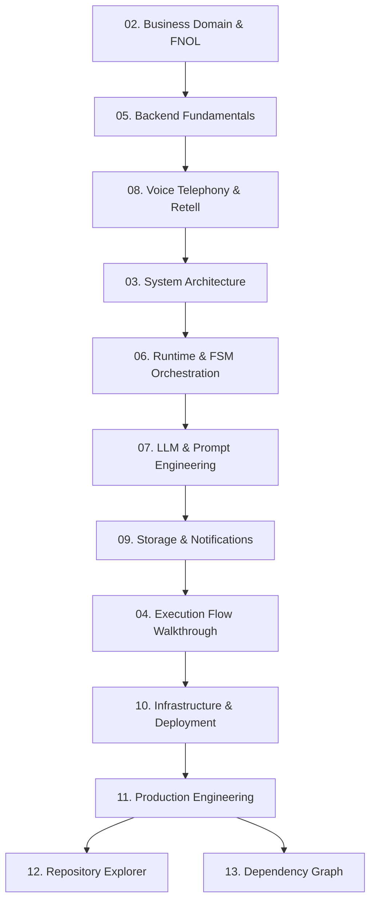

# 01. Knowledge Graph & Priority Matrix

## 1. Business Motivation
**Why does this exist?**  
Before diving into code, an engineer must know *what* to study and *why*. An architecture is only as good as the priority assigned to its components. This section exists to provide a mental map of the system's dependencies and to rank topics by their probability of appearing in a Senior/Staff engineering interview.

## 2. Software Engineering Concept
**Directed Acyclic Graphs (DAGs) and Prioritization.**  
Learning a complex system is a topological sort problem. You cannot understand `ConversationManager.ts` without understanding `WebSockets` and the `Finite State Machine` pattern. This knowledge graph provides the correct dependency resolution for your brain.

## 3. Repository Implementation
This is a meta-document governing how to navigate the rest of this repository's handbook.

## 4. The Optimal Learning Order (Knowledge Graph)

To become the absolute owner of this repository, you must study the concepts in this exact sequence. Skipping ahead will result in blind spots.

## 5. Interview Priority Matrix

Not all code is created equal. Interviewers are highly likely to drill into state management and concurrency, but highly unlikely to care about your Express server boilerplate. 

Use this matrix to allocate your study time.

| Topic / Module | Priority | Est. Time | Probability of Interview Drill-Down |
| :--- | :--- | :--- | :--- |
| **Hybrid Orchestration (FSM + LLM)** | 🔴 CRITICAL | 60m | 95% - *The core differentiator of this project.* |
| **Async Persistence (Outbox Pattern)** | 🔴 CRITICAL | 45m | 90% - *Classic Staff-level system design topic.* |
| **Prompt Engineering & Tool Calling** | 🟠 HIGH | 30m | 80% - *AI engineers must defend hallucination mitigation.* |
| **Voice Telephony (Latency, WebRTC)**| 🟠 HIGH | 30m | 75% - *Domain expertise check.* |
| **Production Scaling (Redis, K8s)** | 🟠 HIGH | 45m | 85% - *Always asked: "How do we scale this to 10k users?"* |
| **Node.js Event Loop / WebSockets** | 🟡 MEDIUM | 20m | 50% - *Standard Node.js trivia.* |
| **Google Sheets API / Resend SDK** | 🟢 LOW | 10m | 10% - *Implementation details are rarely scrutinized.* |
| **Railway Deployment** | 🟢 LOW | 10m | 5% - *DevOps trivia.* |

## 6. Interview Explanation
**How to explain your learning curve:**  
*"When I first approached building this system, I realized I couldn't just throw an LLM at a twilio endpoint. I had to map the dependency graph of the domain. I started by understanding the strict regulatory requirements of FNOL, which dictated a deterministic state machine. Only once the FSM was defined did I integrate the LLM for unstructured extraction, followed by the async persistence layer to ensure no data loss. I approached the architecture topologically."*

## 7. Likely Interviewer Questions
1. **"What was the most complex component of this system to build?"**
2. **"If you had to onboard a junior engineer to this codebase, where would you tell them to start?"**

## 8. Model Answers
1. *"The hybrid orchestration layer (`ConversationManager.ts`). Getting an LLM to seamlessly cooperate with a strict deterministic state machine while managing real-time voice latency was the hardest architectural challenge."*
2. *"I would tell them to ignore the LLM initially. They need to understand the Finite State Machine (FSM) first. If they don't understand the strict business rules the FSM enforces, they won't understand why the LLM prompts are written the way they are."*

## 9. Common Mistakes Candidates Make
- **Starting with the LLM:** Candidates often focus immediately on "AI" and "Prompts". Senior engineers focus on State, Consistency, and Data Flow first. The LLM is just a highly unpredictable function call. Treat it as such.
