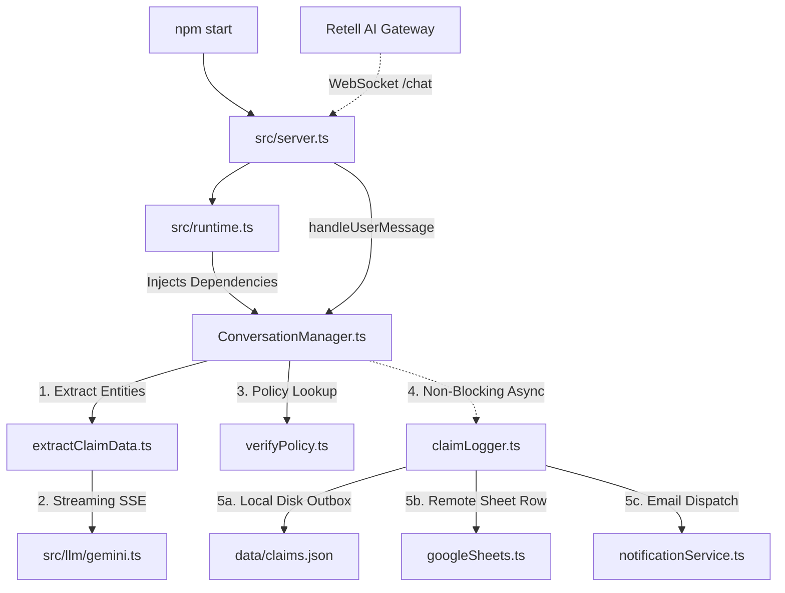

# 02. Repository Explorer

> [!HOTSPOT]
> * **Probability:** 95% | **Est. Time:** 40m | **Difficulty:** Hard
> * **Likely Questions:**
>   - Where does the entrypoint live and how are HTTP and WebSockets co-located?
>   - Which file owns the Finite State Machine (FSM) and why?
>   - How does Dependency Injection work in `runtime.ts`?

---

## 1. Top-Level Repository Directory Map

```
/fnol-voice-agent
├── src/                    # Primary source code directory
│   ├── config/             # Environment constants, policies DB, required fields schema
│   ├── conversation/       # Core FSM Engine & State Machine contracts
│   ├── llm/                # LLM API providers (Gemini, Groq, Fallback interface)
│   ├── services/           # Domain services (Extraction, Policy Verification, Logging)
│   ├── storage/            # External database & storage adapters (Google Sheets)
│   ├── transport/          # Inbound network adapters (Browser WebSocket)
│   ├── types/              # Global TypeScript interfaces & contract definitions
│   ├── runtime.ts          # Dependency Injection (DI) Container
│   └── server.ts           # Express HTTP + WS Entry Point
├── public/                 # Static HTML/JS frontend demo UI
├── handbook/               # SPA Staff Engineer Handbook & Study Guide
├── scripts/                # Python diagram generators & maintenance utilities
├── tests/                  # Automated test suites & test conversation runners
└── docs/                   # Original PRD, architecture reviews, and forensic audits
```

---

## 2. Comprehensive File Matrix (Purpose, Dependencies, Consumers)

| File | Purpose | Key Exports | Imported By (Consumers) | Primary Dependencies |
| :--- | :--- | :--- | :--- | :--- |
| **`src/server.ts`** | Network entry point (Express + WS) | Express app, HTTP server | `npm start` (Railway) | `express`, `ws`, `runtime.ts` |
| **`src/runtime.ts`** | Dependency Injection Container | `createRuntime()`, `createRuntimeConversationManager()` | `src/server.ts` | `gemini.ts`, `googleSheets.ts`, `claimLogger.ts` |
| **`src/conversation/ConversationManager.ts`** | FSM State Engine & Orchestrator | `ConversationManager` class | `src/server.ts` | `extractClaimData.ts`, `verifyPolicy.ts`, `claimLogger.ts` |
| **`src/services/extractClaimData.ts`** | Dynamic Prompts & LLM Extraction | `GeminiExtractClaimDataService` | `ConversationManager.ts` | `src/llm/gemini.ts`, `requiredFields.ts` |
| **`src/services/verifyPolicy.ts`** | Deterministic Policy Lookup | `verifyPolicy()` | `ConversationManager.ts` | `src/config/policies.json` |
| **`src/services/claimLogger.ts`** | Outbox Persistence Engine | `MultiClaimLogger`, `LocalFileLogger` | `ConversationManager.ts` | `googleSheets.ts`, `notificationService.ts` |
| **`src/storage/googleSheets.ts`** | Google Sheets API Adapter | `GoogleSheetsClaimLogger` | `src/services/claimLogger.ts` | `googleapis` SDK |
| **`src/services/notificationService.ts`** | Resend Email Dispatches | `ResendNotificationService` | `src/services/claimLogger.ts` | `resend` SDK |
| **`src/llm/gemini.ts`** | Google Gemini SDK Adapter | `GeminiLLMProvider` | `extractClaimData.ts` | `@google/genai` |
| **`src/types/ConversationState.ts`** | FSM State Contracts | `ConversationState`, `ConversationStep` | Entire `src/` codebase | `Claim.ts`, `Policy.ts` |

---

## 3. Call Dependency Graph



---

## 4. Current vs. Production Architecture Comparison

```
┌───────────────────────────────────────────────────────────────────────────┐
│ 📌 CURRENT IMPLEMENTATION (PROTOTYPE)                                     │
├───────────────────────────────────────────────────────────────────────────┤
│ • State Storage: In-memory `sessions` Map inside Node process            │
│ • State Persistence: Ephemeral disk file (`/data/claims.json`)            │
│ • Deployment Target: Single Railway container instance                   │
│ • Concurrency Control: Sequential turn execution per WebSocket            │
└───────────────────────────────────────────────────────────────────────────┘

┌───────────────────────────────────────────────────────────────────────────┐
│ 🚀 PRODUCTION-SCALE EVOLUTION                                             │
├───────────────────────────────────────────────────────────────────────────┤
│ • State Storage: Distributed Redis Cluster (`ioredis`)                    │
│ • Event Outbox: Apache Kafka / AWS SQS topic (`fnol.claims.completed`)   │
│ • Deployment Target: Kubernetes (EKS) with ALB horizontal pod scaling    │
│ • Concurrency Control: Redlock distributed mutex keyed on `sessionId`     │
└───────────────────────────────────────────────────────────────────────────┘
```

---

> [!RECAP]
> 1. `server.ts` manages network transport (Express HTTP + `ws` WebSocket) without containing business logic.
> 2. `runtime.ts` acts as the Dependency Injection container, wiring implementations together for zero-coupling testability.
> 3. `ConversationManager.ts` is the central orchestrator owning the in-memory state and enforcing FSM compliance.
> 4. `extractClaimData.ts` assembles dynamic prompts per turn and calls Gemini Flash Lite via native SSE.
> 5. `claimLogger.ts` decouples persistence via `Promise.allSettled`, writing to local disk and remote APIs in parallel.
